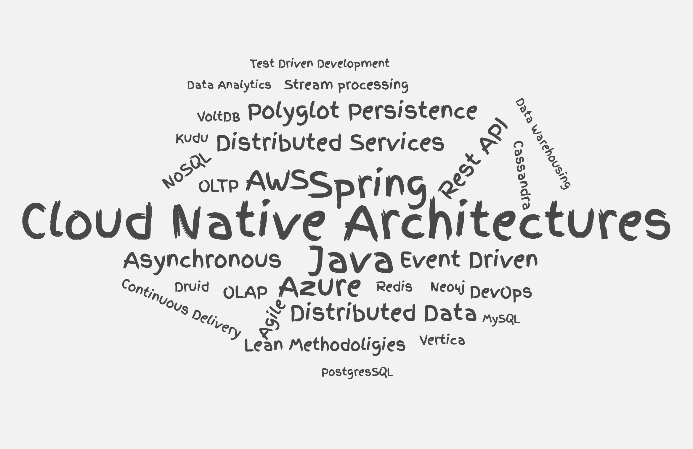

# Profile



## About me

I am a hard-working and dedicated Software Engineer with a focus on delivering high quality solutions that make the required impact.

My main interest is in the development of distributed services that help in extracting value out of business data. Very often they need to handle data at a very large scale; therefore it is critical to design software that can process, store and query data efficiently using different storage technologies.

My priority in any software project is delivering features to the customer that help him make the impacts he needs as soon as possible. I advocate for incremental delivery of value along with continuous evaluation and improvement of the product.

Therefore, I believe in cross-functional agile teams that can work together in an end to end delivery process in order to constantly push out value to the customer while maintaining a high level of software quality.

You can contact me directly by [email](mailto:i_kh@icloud.com?subject=[Resume]%20Getting%20in%20touch).

## Experience

### Anchormen / Amsterdam, the Netherlands - January 2020 - Present

Anchormen is a data-driven company which delivers services in consultancy, training and support in Machine Learning, Data Science, and Artificial Intelligence.

I am a software and data engineering consultant that helps customers unlock new opportunites using their data. I am responsible for the design and provisioning of cloud infrastructure, along with the development of data oriented services in order to allow the customer to analyze insights generated from his data.

### Relay42 / Amsterdam, the Netherlands - October 2018 - December 2019

Relay42 is a marktech company that provides a customer data management platform and intelligent journey orchestration engine which helps you personalise your user's experiences across all your conencted channels.

I was a backend software engineer responsible for a service that handles the integration of relay's platform with all external marketing platforms. This required the design of a highly efficient service that can handle the traffic generated by the orchestration engine, while being extremely resilient to the failures that can happen at the integratoin points with other systems.

### Smarty Systems / Zalka, Lebanon - February 2017 – August 2018

Smarty was a young data oriented startup that set out to discover and analyse the huge online world of news. It provided a platform for users to search for any piece of news content using a combination of search filters that can understand the content. Smarty also tracked the performance of news content over time on social media, allowing the user to view real time insights about what is trending around the world.

I was responsible for implementing the data infrastructure that handled the storage and querying of Smarty's data which powered the end user application.
I was required to support a variety of data types and storage technologies that allowed the analysis of full text as well as statistical data.

## Education

### B.S in Computer Science - June 2017

Graduated from Notre Dame University, Lebanon.

## Languages

- Arabic (Native Proficiency)
- English (Professional Proficiency)
- French (Limited Working Proficiency)

## Certification

- [AWS Certified Solutions Architect – Associate](https://www.youracclaim.com/badges/48790cf7-1d40-4c76-996f-1e87ac612503/public_url)

[Download Resume](assets/issa_khoury_resume.pdf)
